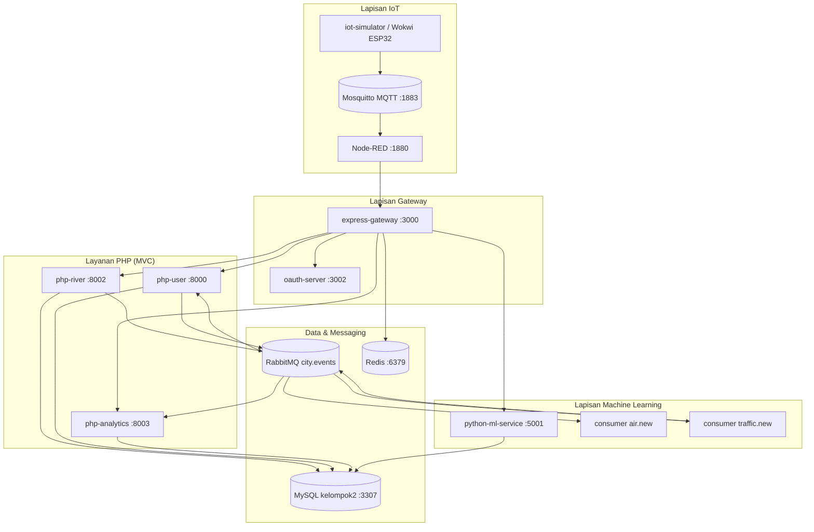
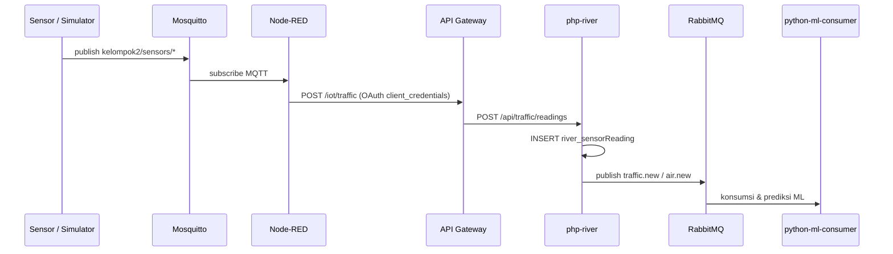
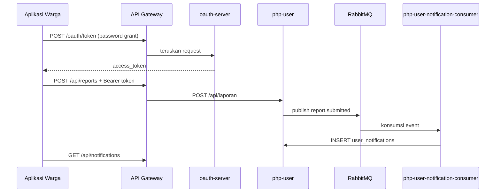
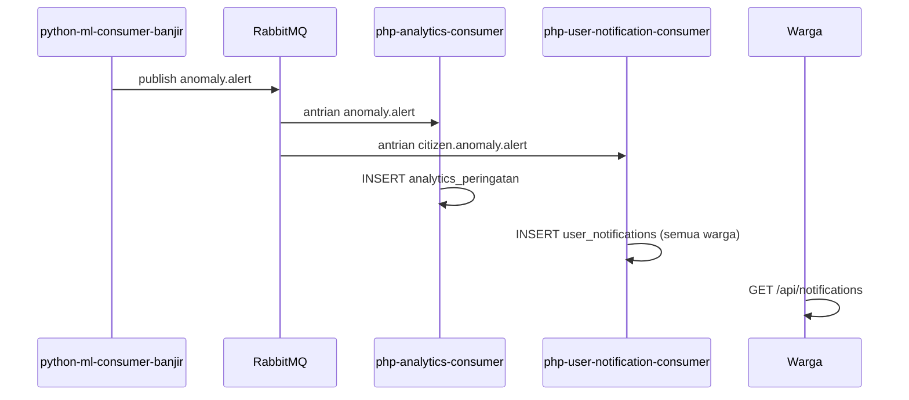

# Arsitektur — Smart Flood Warning System

> Ekspor dokumen ini ke PNG/PDF untuk deliverable spesifikasi §12 butir #3 (diagram arsitektur + diagram urutan).

Dokumen ini melengkapi [`README.md`](../README.md). Label teknis (nama service, path API, routing key RabbitMQ) sengaja tetap dalam bahasa Inggris karena itu nama resmi di kode dan container.

---

## Gambaran sistem (overview)

**Keterangan:** Port yang ditampilkan adalah **port host** saat menjalankan `docker compose up` di mesin lokal. Lalu lintas eksternal masuk melalui **API Gateway (:3000)**.

---

## S1 — Ingesti data IoT

Skenario: sensor/simulator → MQTT → Node-RED → Gateway → php-river → RabbitMQ → konsumer ML.

**Verifikasi otomatis:** `bash iot/tests/s1-e2e.sh`

---

## S2 — Login warga & pengajuan laporan

Skenario: OAuth password grant → token → submit laporan → event RabbitMQ → notifikasi warga.

**Verifikasi otomatis:** `bash express-gateway/tests/s2-report-e2e.sh`

---

## S6 — Alert anomali ke warga

Skenario: ML mendeteksi risiko banjir → publish `anomaly.alert` → peringatan analytics + notifikasi citizen (fan-out queue).

---

## Pemetaan domain (Tugas Besar → Proyek Banjir)

| Layanan spesifikasi | Folder / service | Tabel database | Catatan |
|---------------------|------------------|--------------|---------|
| Citizen Service | `php-user` | `user_*` | Warga, laporan, notifikasi, riwayat banjir |
| Traffic Service | `php-river` | `river_*` | Zona, sungai, node sensor, pembacaan |
| Environment Service | `php-analytics` | `analytics_*` | Peringatan waspada / bencana |
| OAuth Server | `oauth-server` | `auth_*` | Client & token OAuth |
| API Gateway | `express-gateway` | — | Routing, JWT, rate limit |
| Traffic Predictor (ML) | `python-ml-service` | — | Model: prediksi curah hujan |
| Air Quality Classifier (ML) | `python-ml-service` | — | Model: deteksi banjir berdasarkan cuaca |
| Anomaly Detector (ML) | `python-ml-service` | — | Model: Isolation Forest (`deteksi_anomali.pkl`) |

---

## Topologi RabbitMQ (ringkas)

Exchange: **`city.events`** (topic)

| Routing key | Antrian | Publisher | Consumer |
|-------------|---------|-----------|----------|
| `traffic.new` | `traffic.new` | php-river | python-ml-consumer-banjir |
| `air.new` | `air.new` | php-river | python-ml-consumer-air |
| `anomaly.alert` | `anomaly.alert` | ML consumer banjir | php-analytics-consumer |
| `anomaly.alert` | `citizen.anomaly.alert` | (fan-out) | php-user-notification-consumer |
| `report.submitted` | `report.submitted` | php-user | php-user-notification-consumer |

---

## Cara mengekspor ke PNG/PDF

1. Buka file ini di VS Code / Cursor dengan preview Mermaid, atau tempel diagram ke [mermaid.live](https://mermaid.live).
2. Ekspor setiap diagram sebagai PNG.
3. Susun di satu halaman (overview + minimal S1 dan S2) untuk lampiran laporan atau slide presentasi.

Alternatif: gunakan plugin Mermaid di draw.io / FigJam jika tim sudah punya template visual.
